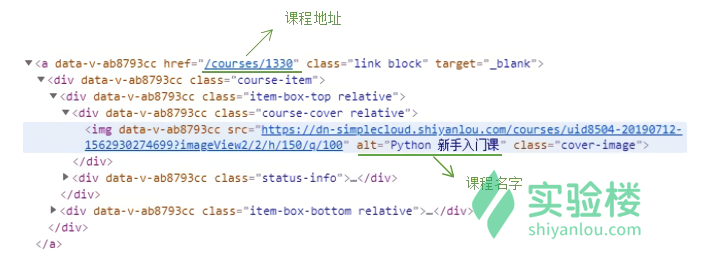
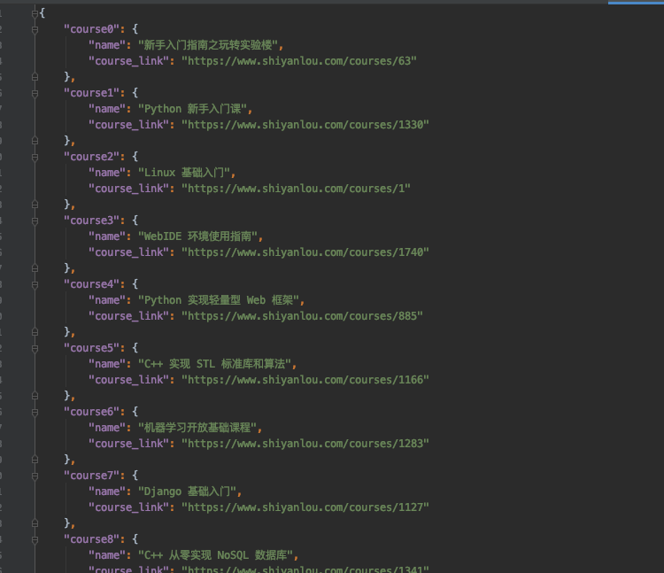

## Task 1: Scrapy Best Universities in the word

## Task 2: Scrapy Course

1. Scrapy courser information from Shiyanlou Open Course Platform. 
2. Save them into a json file: infoDict.json

Example is shown here:

## Task 3: Scrapy House

