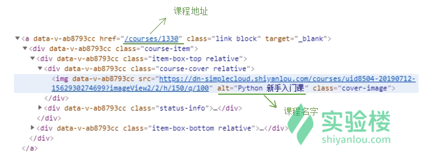
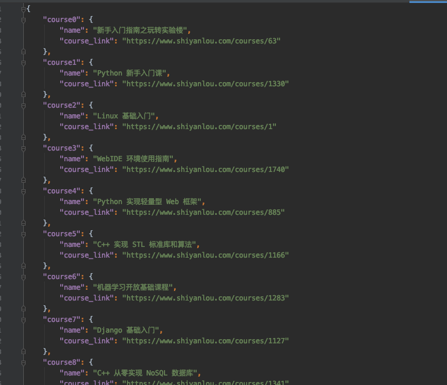

## Task 1: Scrapy Best Universities in the word

## Task 2: Scrapy Course

1. Scrapy courser information from Shiyanlou Open Course Platform. 
2. Save them into a json file: infoDict.json

Example is shown here:

- Hints:
find() is a method to search the document tree, it can return the first matched element. 
Its complete parameter form is: find( name, attrs, recursive, string, **kwargs ). 
The parameter name retrieves the string by tag name, 
the parameter attrs retrieves the string by tag attribute value, 
whether the parameter recursive retrieves all descendants, the default is True, 
and the parameter string is the non-attribute character string in the retrieval tag.

children is a property that traverses down the label. 
There are three traversal forms for tags, which are downlink traversal, uplink traversal and parallel traversal.

- Downstream traversal has the following three attributes:
.children is looping through the son node
.descendants loops through all descendant nodes
.contents is to store all the son nodes in the tag into the list

- The upstream traversal has the following two attributes:
.parent is the parent node label to access the node
.parents is to loop through all ancestor nodes
